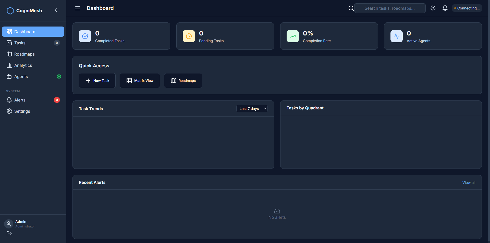
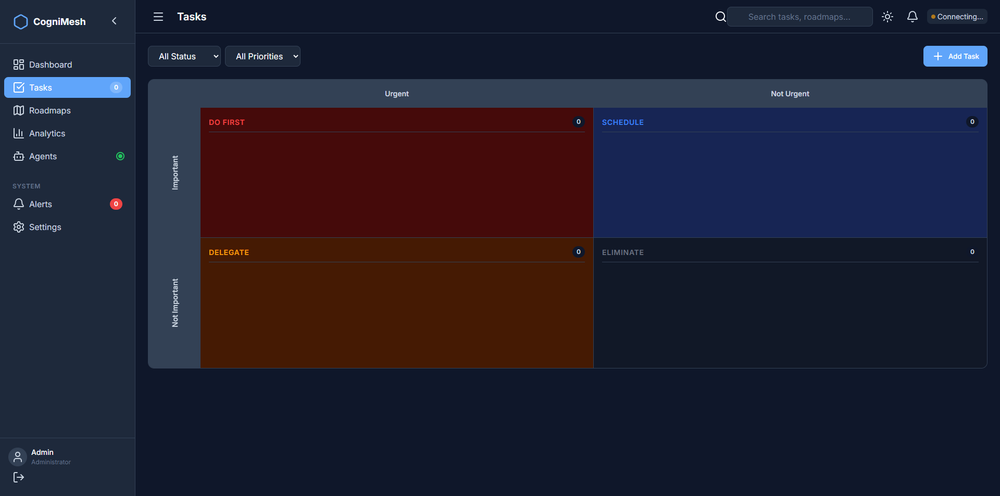
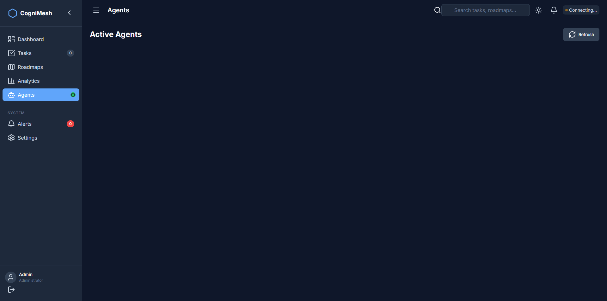

# Your First Task with CogniMesh

> **Go from zero to your first AI-orchestrated task in 10 minutes.**

<div align="center">


**Tutorial Time: ~10 minutes**

</div>

---

## What You'll Learn

By the end of this tutorial, you will:

- ✅ Have CogniMesh running locally
- ✅ Create your first task
- ✅ Assign it to an AI agent
- ✅ View task status and results
- ✅ Understand the basic workflow

---

## Prerequisites

Before starting, ensure you have:

- **Node.js 18+** installed ([Download](https://nodejs.org/))
- **Git** installed ([Download](https://git-scm.com/))
- **15 minutes** of uninterrupted time
- At least one AI subscription: Claude Pro, ChatGPT Plus, or Kimi

---

## Step 1: Install CogniMesh (2 minutes)

Open your terminal and run:

```bash
# Clone the repository
git clone https://github.com/LastEld/Ckamal.git
cd Ckamal

# Install dependencies
npm install
```

**Expected output:**
```
added 847 packages in 45s
```

> 💡 **Tip:** If you see warnings about deprecated packages, don't worry — these are safe to ignore.

---

## Step 2: Verify Installation (2 minutes)

Run the verification suite to ensure everything works:

```bash
npm run verify:release
```

**Expected output:**
```
✓ Lint passed
✓ Unit tests passed (42 tests)
✓ Integration tests passed (18 tests)
✓ E2E tests passed (12 tests)
✓ Provider matrix verified
✓ Documentation validated

All verification checks passed! ✨
```

**If you see errors:**
- Check [Troubleshooting Guide](../TROUBLESHOOTING.md)
- Common fix: `rm -rf node_modules && npm install`

---

## Step 3: Start the Server (1 minute)

Launch CogniMesh:

```bash
npm start
```

**Expected output:**
```
[BIOS] CogniMesh v5.0.0
[BIOS] Mode: OPERATIONAL
[BIOS] Database: connected
[BIOS] HTTP Server: running on port 3000
[BIOS] WebSocket Server: running on port 8080
[BIOS] Dashboard: running on port 3001
[BIOS] Ready ✓
```

**Keep this terminal open!** The server needs to run continuously.

---

## Step 4: Access the Dashboard (1 minute)

Open your web browser and navigate to:

```
http://localhost:3001
```

You should see the CogniMesh dashboard:


> 💡 **Tip:** Bookmark this page for easy access!

---

## Step 5: Create Your First Task (3 minutes)

### Option A: Using the Dashboard (Recommended for Beginners)

1. Click the **"New Task"** button in the top-right corner
2. Fill in the task details:
   - **Title**: `Write a Python function to calculate factorial`
   - **Description**: `Create a clean, well-documented Python function that calculates the factorial of a number. Include error handling for negative numbers and non-integer inputs.`
   - **Priority**: Select `Medium`
   - **Due Date**: (Optional) Tomorrow

3. Click **"Create Task"**



### Option B: Using the API (For Developers)

In a new terminal window, run:

```bash
curl -X POST http://localhost:3000/api/tasks \
  -H "Content-Type: application/json" \
  -d '{
    "title": "Write a Python function to calculate factorial",
    "description": "Create a clean, well-documented Python function that calculates the factorial of a number.",
    "priority": "medium"
  }'
```

**Expected response:**
```json
{
  "success": true,
  "data": {
    "id": "task_abc123",
    "title": "Write a Python function to calculate factorial",
    "status": "pending",
    "priority": "medium",
    "createdAt": "2026-03-28T10:00:00.000Z"
  }
}
```

---

## Step 6: Assign to an AI Agent (1 minute)

Now let's assign this task to an AI agent:

### Using the Dashboard

1. Click on your newly created task
2. Click **"Assign Agent"**
3. Select an AI provider:
   - **Claude Sonnet 4.6** - Best for code tasks
   - **GPT-5.4 Codex** - Great for general programming
   - **Kimi K2.5** - Excellent for documentation

4. Click **"Start Agent"**

### Using the CLI

```bash
# Assign task to Claude
node src/bios/cli.js agent spawn --task=task_abc123 --provider=claude --model=sonnet-4-6
```

---

## Step 7: Monitor Progress (Ongoing)

### Watch the Task Progress

In the dashboard, you'll see the task move through states:

```
pending → in_progress → completed
```



### View Agent Activity

Click on the **"Agents"** tab to see active agents:



---

## Step 8: Review Results (When Complete)

Once the agent completes the task:

1. Click on the completed task
2. View the **"Results"** section
3. You'll see:
   - Generated code
   - Documentation
   - Test cases (if requested)

### Sample Output

```python
def factorial(n):
    """
    Calculate the factorial of a number.
    
    Args:
        n (int): A non-negative integer
        
    Returns:
        int: The factorial of n
        
    Raises:
        ValueError: If n is negative or not an integer
        TypeError: If n is not a number
    """
    if not isinstance(n, (int, float)):
        raise TypeError("Input must be a number")
    
    if not n == int(n):
        raise ValueError("Input must be an integer")
    
    n = int(n)
    
    if n < 0:
        raise ValueError("Factorial is not defined for negative numbers")
    
    if n == 0 or n == 1:
        return 1
    
    result = 1
    for i in range(2, n + 1):
        result *= i
    
    return result


# Test cases
if __name__ == "__main__":
    assert factorial(0) == 1
    assert factorial(1) == 1
    assert factorial(5) == 120
    assert factorial(10) == 3628800
    print("All tests passed!")
```

---

## Common Pitfalls & Solutions

### ❌ Pitfall 1: "No AI clients found"

**Error:**
```
No AI clients available. Please install and authenticate at least one provider.
```

**Solution:**

Install at least one AI CLI:

```bash
# Option 1: Claude
brew install claude  # macOS
# Or download from: https://docs.anthropic.com/en/docs/claude-cli
claude login

# Option 2: Codex
npm install -g @openai/codex
codex login

# Option 3: Kimi
npm install -g kimi-cli
kimi login
```

---

### ❌ Pitfall 2: "Task stuck in pending"

**Symptoms:** Task doesn't start after assignment

**Solutions:**

1. Check server logs:
```bash
tail -f logs/app.log
```

2. Verify agent pool status:
```bash
curl http://localhost:3000/api/agents/status
```

3. Restart the agent:
```bash
# In dashboard: Click "Restart Agent"
# Or via CLI:
node src/bios/cli.js agent restart --id=agent_xyz789
```

---

### ❌ Pitfall 3: "Cannot connect to dashboard"

**Error:**
```
This site can't be reached - localhost refused to connect
```

**Solutions:**

1. Check if server is running:
```bash
curl http://localhost:3000/health
```

2. Check port availability:
```bash
# Linux/macOS
lsof -i :3001

# Windows
netstat -ano | findstr :3001
```

3. Change dashboard port:
```bash
# In .env
DASHBOARD_PORT=3002
# Restart: npm start
```

---

## Next Steps

Congratulations! You've completed your first task with CogniMesh. 🎉

### Explore More Features

1. **Create a Roadmap** → Plan multi-step projects
   - Go to **Roadmaps** tab
   - Click **"New Roadmap"**
   - Add milestones and tasks

2. **Try Batch Processing** → Handle multiple tasks at once
   - Select multiple tasks
   - Click **"Batch Assign"**

3. **Set Up Integrations** → Connect your IDE
   - [VS Code Integration](../../docs/kimi-vscode-integration.md)
   - [Claude Desktop](../../docs/CLAUDE_DESKTOP_OPUS46_INTEGRATION.md)

### Learn More

- **[Architecture Overview](../../ARCHITECTURE.md)** - Understand how CogniMesh works
- **[API Reference](../../API_REFERENCE.md)** - Build custom integrations
- **[Deployment Guide](../../DEPLOYMENT.md)** - Run in production

---

## Quick Reference

### Common Commands

```bash
# Start server
npm start

# Run diagnostics
npm run bios:diagnose

# Check health
curl http://localhost:3000/health

# View logs
tail -f logs/app.log

# Create task via API
curl -X POST http://localhost:3000/api/tasks \
  -H "Content-Type: application/json" \
  -d '{"title":"My Task","priority":"medium"}'

# List all tasks
curl http://localhost:3000/api/tasks

# Get task details
curl http://localhost:3000/api/tasks/task_abc123
```

### Keyboard Shortcuts (Dashboard)

| Shortcut | Action |
|:---------|:-------|
| `Ctrl + N` | New task |
| `Ctrl + /` | Search tasks |
| `Ctrl + R` | Refresh |
| `?` | Show help |

---

## Summary

In this tutorial, you:

1. ✅ Installed CogniMesh
2. ✅ Started the server
3. ✅ Created your first task
4. ✅ Assigned it to an AI agent
5. ✅ Reviewed the results

You now have a working CogniMesh installation ready for real-world use!

---

<div align="center">

**[Back to Documentation Hub](../README.md)** · **[Troubleshooting](../TROUBLESHOOTING.md)** · **[API Reference](../../API_REFERENCE.md)**

<sub>Questions? Check the [Troubleshooting Guide](../TROUBLESHOOTING.md) or [open an issue](https://github.com/LastEld/Ckamal/issues)</sub>

</div>
